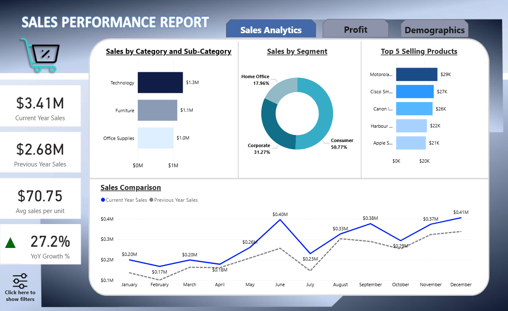
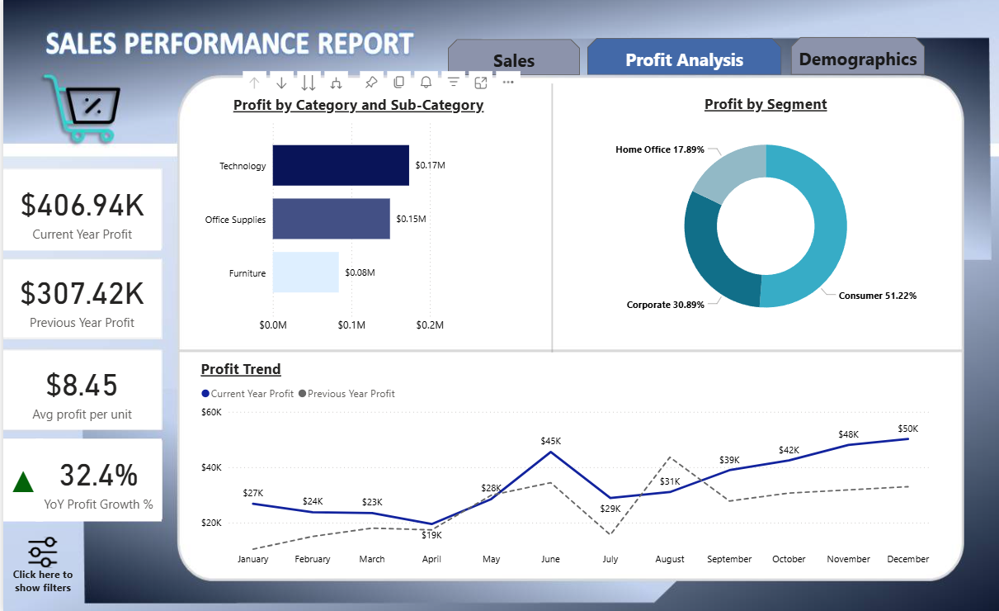
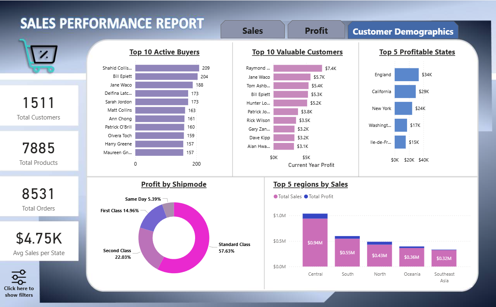

# Global Superstore Analytics Dashboard

## Overview

This project presents an interactive Power BI dashboard built using the Global Superstore dataset.
The analysis is structured using **Descriptive Analytics (What happened)** and **Diagnostic Analytics (Why it happened)** to derive meaningful business insights.

The dashboard enables users to explore sales, profit, and customer behavior through interactive visuals, data modeling, and DAX-driven calculations.

---

## Objectives

* Understand overall sales and profit performance
* Identify key drivers behind revenue and profitability
* Analyze customer purchasing behavior
* Detect trends and patterns across regions, categories, and time

---

## Tools and Technologies

* Power BI Desktop
* DAX (Data Analysis Expressions)
* Data Modeling (Date Table, Relationships)
* Global Superstore Dataset (CSV/Excel)

---

## 🔹 Descriptive Analysis (What Happened?)

Descriptive analytics was used to summarize historical data and provide a clear view of business performance:

### Sales Analysis

* Total Sales, Current Year (CY) Sales, Previous Year (PY) Sales
* Year-over-Year (YoY) Growth (%)
* Sales trends over time
* Sales distribution by category, segment, and region
* Top 5 products by sales

### Profit Analysis

* Total Profit, CY Profit, PY Profit
* YoY Profit Growth (%)
* Profit distribution across categories and sub-categories
* Top 5 profitable products
* Profit trends over time

### Customer Analysis

* Top 10 active customers (by quantity)
* Top 10 valuable customers (by profit contribution)
* Regional performance comparison
* Profit distribution by shipping mode

This analysis provides a **complete snapshot of business performance**.

---

## 🔹 Diagnostic Analysis (Why It Happened?)

Diagnostic analytics was applied to identify root causes behind observed trends and performance variations:

* Comparison of **Sales vs Profit** to detect low-margin products
* Identification of categories with **high sales but low profitability**
* Regional analysis to understand **performance disparities across locations**
* Customer segmentation to identify **high-value vs low-value customers**
* Impact of shipping mode on profitability
* Trend analysis to identify **seasonal patterns and fluctuations**
* Detection of underperforming products and regions

This helps explain **why certain areas perform better or worse**, enabling data-driven decision-making.

---

## Dashboard Structure

### Sales Dashboard

* Sales KPIs and YoY trends
* Category and segment-wise performance
* Product-level insights

### Profit Dashboard

* Profit KPIs and growth trends
* Margin analysis
* Sub-category performance

### Customer Demographics Dashboard

* Customer segmentation and contribution
* Regional and state-level insights
* Shipping mode analysis

---

## Key Features

* Multi-page interactive dashboard
* Bookmark-based filter panel with toggle functionality
* Top-N filtering for focused insights
* Time intelligence using DAX (YoY, Previous Year)
* KPI cards for quick monitoring
* Consistent and user-friendly visual design

---

## Data Modeling

* Created a dedicated Date Table using DAX
* Established relationships between tables
* Used measures instead of calculated columns for efficiency
* Implemented time intelligence using SAMEPERIODLASTYEAR

---

## Screenshots

### Sales Dashboard

### Profit Dashboard

### Demographics Dashboard

---

## Key Insights

* A small group of customers contributes significantly to total revenue and profit
* Some product categories generate high sales but low profit margins
* Regional performance varies significantly, indicating location-based opportunities
* Shipping methods influence profitability and cost efficiency
* Seasonal trends impact both sales and profit across years

---

## How to Use

1. Open the `.pbix` file in Power BI Desktop
2. Use filters and slicers to refine analysis
3. Navigate between dashboard pages
4. Interact with visuals for deeper insights

---

## Future Enhancements

* Add predictive/forecasting analysis
* Implement row-level security
* Optimize dashboard for mobile view
* Integrate real-time or streaming data

---

## Contact

For queries or collaboration, feel free to connect via LinkedIn or GitHub.
